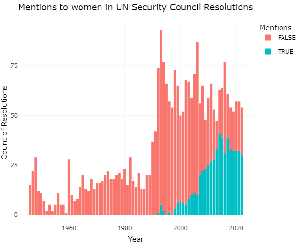

# Women in International Peace and Security: mapping the topic across a network of UN Security Council resolutions
## By Alice L. W. Gallindo, Maria Clara M. B. Dias, Poliana J. N. Viana, Sofia M. Ratis, with the support of Carlos Miguel C. Vasconcelos and prof. Rafael Mesquita (Federal University of Pernambuco, Brazil)
### Prepared for the 2024 Data Visualization Competition of the DataConnect Conference

When and how did women begin to be part of the conversation on global peace and security?

This series of visualizations aim to translate, in an accessible way, how the resolutions adopted by the UN Security Council - the highest international body on war and peace - addressed issues relating to women in international conflicts.  

The project is based on a corpus containing all resolutions adopted by the Security Council. The original PDFs for each resolution that were available in the [UN Digital Library](https://digitallibrary.un.org/) were transformed them into digital text using Optical Character Reading (OCR) and, given the state of some older documents, corrected for typos and any imprecise conversion. 

Of the 2,671 resolutions passed by the Security Council, since its creation until 2022, we selected those that mentioned the keyword ‘women’ in their text. A total of 562 resolutions evoked the term. As the resolutions are not meaningful in isolation, we organized them into a citation network. We detected what other within-corpus resolutions were cited as precedent by each new resolution. The resulting network was submitted to the [InfoMap community detection algorithm](https://www.mapequation.org/) to identify clusters formed by the density of citation patterns.[^1] 

We found 47 communities, of which five stood out, as they gathered the majority of documents and some of the most cited ones. To allow users to interactively explore this network and autonomously learn about the many ways in which women were mentioned at the Security Council, we fed this data to the [Retina web application](https://ouestware.gitlab.io/retina/1.0.0-beta.1/#/) to build an interactive visualization. By clicking at each node in the network, users will see the title of the resolution, its incoming and outgoing citations, and read a small summary that we have manually composed for the most salient resolutions, explaining their content and importance for women in international peace and security.

### Explore the network of UN Security Council resolutions on the topic of women :dove:

link

### How salient is the topic of women on UN Security Council resolutions over the years? :bar_chart:

Click on the image or [here](https://rpubs.com/rafaelmesquita/dataviz24_sc_fig1) for interactive chart

### What terms characterized each decade? :speech_balloon:
The following plot is a comparative wordcloud that indicates what words were distinctive to each time period. It allows us to see, from the first mentions to women in Security Council resolutions in the 1990s, until the current decade, what were some of the accompanying topics and the context in which women were being references. The terms unique to each decade show some of the hot-spots with which the international community was grappling at each point in time and the UN missions deployed to these locations.

[^1]: D. Edler, A. Holmgren and M. Rosvall, The MapEquation software package. As implemented in the R package igraph.
